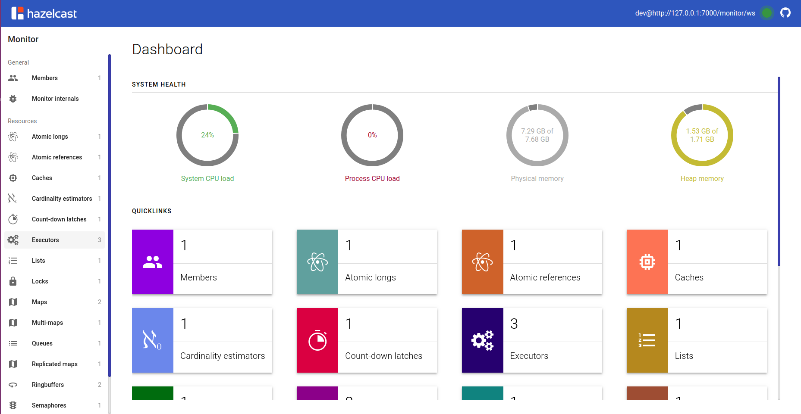
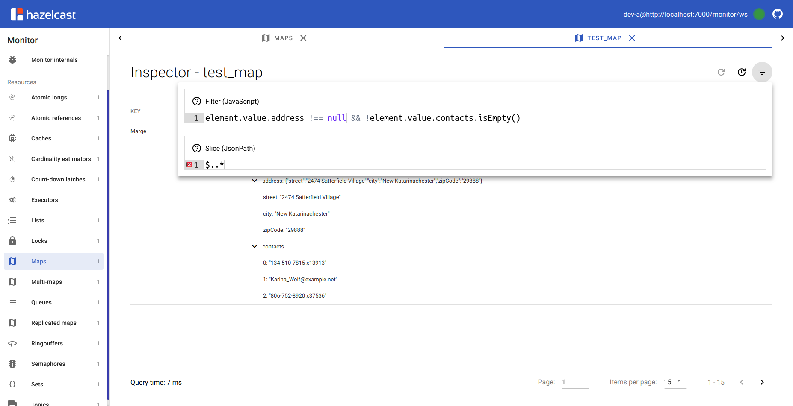
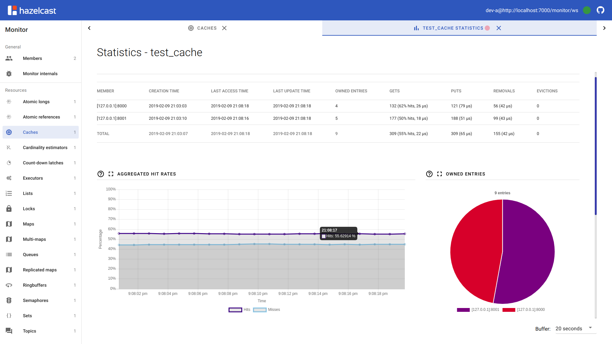
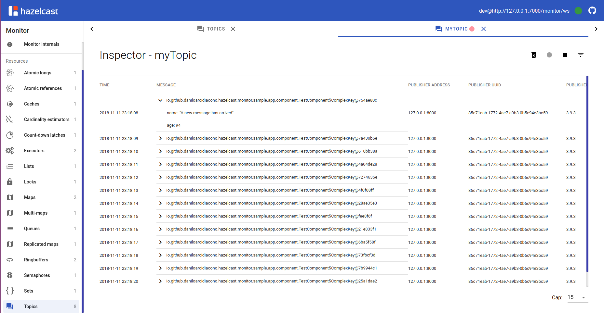

# Hazelcast Monitor
This is an unofficial monitoring tool for Hazelcast, featuring:

* Thorough inspection of maps/multi-maps/replicated maps (no need to "guess" the keys!), atomic longs, atomic references, caches, cardinality estimators, count-down latches, executors, lists, locks, queues, ringbuffers, semaphores, sets and topics;
* Statistics for caches, executors, maps, queues and topics;
* Data filtering with JavaScript conditions;
* Data slicing with JSONPath expressions;
* Integration module with Java-WebSocket library;
* Integration module with Spring Boot framework;

# Images

## Modules
* `hazelcast-monitor-agent`: the main agent, that pulls data from the Hazelcast cluster;
* `hazelcast-monitor-starter-spring`: integration module with Spring Boot;
* `hazelcast-monitor-starter-java-websocket`: integration module with Java-WebSocket; 
* `hazelcast-monitor-sample-app`: an example application using Hazelcast;
* `hazelcast-monitor-webapp`: the front-end application of the monitor;

# TODO
4) Fix ExpressionChangedAfterItHasBeenCheckedError;
5) Cache stats crash when launching (one) and (two) apps;
8) build: Update README (and hazelcast-monitor-webapp/README.md);
9) build: Update POM for deploy;
10) docs: Write documentation with Antora;

# DONE
1) webapp: fix dropdowns in clusters page;
2) sample-app: two Hazelcast instances on the same JVM;
3) agent: Pure Java socket implementation (module);
4) webapp: centralize common logic in "master" views;
5) prod-build;
6) sample-app: Variable frequency in test app;
7) Fix icone custom piccole nella side-bar;
8) ace editor warning name.split is not a function;